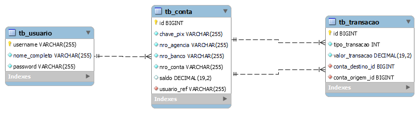

# Teste Turing - Itaú

Aplicação desenvolvida para o Processo Seletivo do Programa de Estágio do Banco Itaú.
- Sistema que simula as transações bancárias — PIX, TED, DOC
- Orientações fornecidas: [README.md](https://github.com/itau-canais-estag/teste-turing/blob/main/README.md)


## Requisitos

- Java 11+
- Maven 3+
- Mysql 8+

## Setup

### Clonar o aplicativo

```
https://github.com/swy-326/teste-turing.git
```

### Configurar MySql

No arquivo `src\main\resources\application.properties`, configure o username e password

```
# MySQL
spring.datasource.username=root
spring.datasource.password=
```

### Build e Run

```
mvn clean spring-boot:run
```

O servidor será iniciado em http://localhost:8080


## Desenvolvimento

### Modelagem de Banco de Dados


